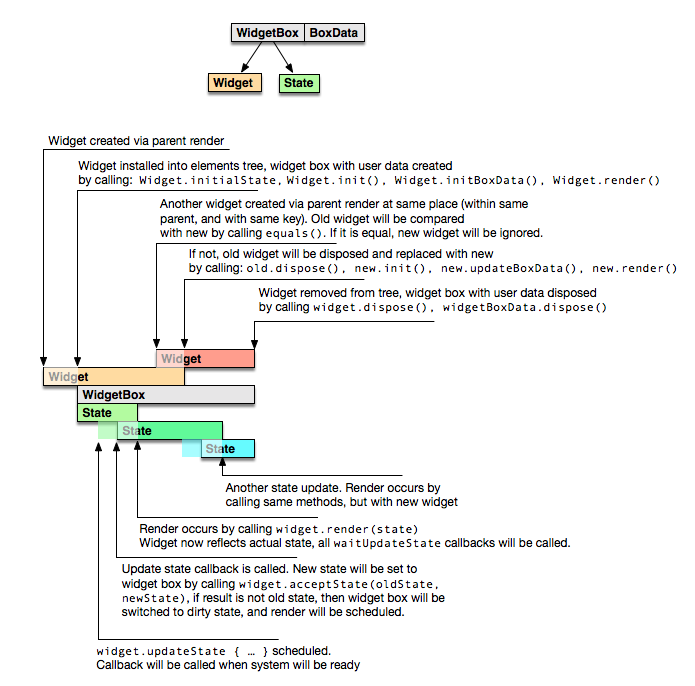

# Что это?

Это часть библиотеки для реализации кроссплатформенного ui, которая, в свою очередь, являются частью другого фреймворка, описание которого за рамками этой статьи.

Этот репозиторий - демонстрация альтернативного подхода к созданию `DSL` для описания дерева элементов [React](https://reactjs.org/). `DSL` - dynamic specific language. В React в этой роли выступает [JSX](https://reactjs.org/docs/glossary.html#jsx), который добавляет подобие `html` в `js`. В котлине используются исключительно языковые возможности Котлина.

## Подход JetBrains

JetBrains предлагают использовать библиотеку `kotlinx.html`, которая реализует
идею [type-safe builder](http://kotlinlang.org/docs/reference/type-safe-builders.html).

Пример (из [kotlin-fullstack-sample](https://github.com/Kotlin/kotlin-fullstack-sample/blob/master/frontend/src/org/jetbrains/demo/thinkter/Login.kt)):

```kotlin
    fun ReactDOMBuilder.render() {
        div {
            h2 { +"Thoughts" }

            if (state.loading) {
                p { +"Loading..." }
            } else {
                h3 { +"Top" }
                ThoughtsListComponent {
                    thoughts = state.top
                    show = props.showThought
                }

                h3 { +"Recent" }
                ThoughtsListComponent {
                    thoughts = state.latest
                    show = props.showThought
                }
            }
        }
    }
```

На основе `kotlinx.html` предлагается надстройка над `React`, которая позволяет создавать пользовательские компоненты в виде классов:

```kotlin
class HomeView : ReactDOMComponent<HomeView.Props, HomeView.State>() {
    companion object : ReactComponentSpec<HomeView, Props, State>

    init {
        state = State(emptyList(), emptyList(), true, Polling.NewMessages.None)
    }
}
```

При использования такого подхода возникает ряд сложностей и неявной логики (субъективно), решеием которых и является альтернативный подход описанный ниже. Ниже перечислены проблемы который предлагается решить.

#### Объявление класса компонента

В описанном выше подходе, объявление класса компонента выглядит громоздко. Но, идей упрощения вроде как и нет. Нужны и `Props` и `State`. `companion object` при этом выуступает в виде фабрики (т.к. в `React.createElement` передается именно фабирка, а реакт уже сам создает компонент, если его требуется обновить).

С другой стороны, мы всегда передаем инстанс `Props`, который и может является фабиркой. Именно за счет этого и возможно упрощение.

#### Добавление дочерних элементов

Есть сложности и с `kotlinx.html`, но более субъективные.

Самая главная - неявное добавление в родительский элемент дочеренего вызовом функций-тэгов (`p { ... }` и `h3 { ... }`). Кроме того, такой подход вынуждает для каждого HTML элемента объявлять отдельно класс, и отдельно функцию для DSL.

С базовыми тэгами особых проблем нет, их список легко запомнить. А вот с пользовательскими компонентами сложнее. Для того чтобы понять добавляется ли он автоматический в родителя или это обычная функция принимающая лямбду, нужно понимать является ли это название компонентом (в данном случае `ReactComponentSpec`).

При этом добавление текста выглядит иначе: оно происходит более явно: `+"text"`.

#### Mutable

Все `Props`-ы должны быть mutable, иначе `DSL` не будет работать (имеются ввиду пользовательские `React` компоненты).

## Альтернативное решение

Начнем с примера компонента без состояни и дочерних элементов ([просмотреть в браузере](https://htmlpreview.github.io/?https://raw.githubusercontent.com/snrostov/ui-dsl/master/index.html#hello-widgets)):

```kotlin
fun main(args: Array<String>) {
  val container = document.getElementById("content")!!

  render(container) {
    +Header("s1", "About")
    +"The contents for about section"

    +Header("s1", "Docs")
    +"The contents for docs section"
  }
}

class Header(key: Any?, val text: String) : StatelessWidget(key) {
  override fun render() = Text(fontSize = 20.0) {
    +text
  }
}
```

Разберемся в чем отличие.

1. Компоненты назваются Виджетами (`Widget`), т.к. их семантика отличается от компонентов реакта. Название "виджет" позаимствовано у `flutter`, где виджеты также имеют неизменяемы свойства (но по другим причинам, и имеют другой цикл жизни в дереве элементов `ui`).
2. Все параметры Widget-ы неизменяемы. При необходимости изменений, виджет будет пересоздан. По факту Widget с точки зрения реакта - это ни что иное как `Props`. 
3. Для добавления дочерних элементов необходимо добавить `+`. Без `+` - виджет не будет добавлен в родительский элемент. Таким образом добавляение элементов приобретает явный вид и выглядит одинаково и для текста и для элементов. Но, возникает другая проблема - если забыть `+`, то элемент не будет добавлен. А зыбть его довольно легко. Проблема должна решится подсказкой IDE, когда появится аннотация `@CheckResult` или аналогичная ей ([KT-12719](https://youtrack.jetbrains.com/issue/KT-12719), [KT-18024](https://youtrack.jetbrains.com/issue/KT-18024)).

### Дочерние элементы

Как было сказано, для добавления дочерних элементов необходимо явно вызывать `+`.

Реализовано это следующим образом: по конвенции, последним параметром конструктора виджета который содержит дочерние элементы должна быть лямбда `val body: WidgetBody`. (`typealias WidgetBody = WidgetsListBuilder.() -> Unit`). При этом сам `WidgetBody` можно также добавить в `WidgetsListBuilder` (будет вызывана соотвтсвующая функция).

Пример ([просмотреть в браузере](https://htmlpreview.github.io/?https://raw.githubusercontent.com/snrostov/ui-dsl/master/index.html#hello-widget-body)):

```kotlin
fun main(args: Array<String>) {
  val container = document.getElementById("content")!!

  render(container) {
    +Section(key = "s1", title = "About") {
      +"About contents"
    }

    +Section(key = "s1", title = "Docs") {
      +"Docs contents"
    }
  }
}

class Section(key: Any?, val title: String, val body: WidgetBody) : StatelessWidget(key) {
  override fun render() = Box {
    +Header("title", title)
    +body
  }
}

class Header(key: Any?, val text: String) : StatelessWidget(key) {
  override fun render() = Text(fontSize = 20.0) {
    +text
  }
}
```

Билдер дочерних элементов `WidgetsListBuilder` выглядит так:

```kotlin
abstract class WidgetsListBuilder {
  abstract fun add(obj: RenderObject)

  abstract fun add(text: String)

  abstract fun add(number: Number)

  abstract fun <S : Any, W : Widget<S>> add(widget: W)

  operator fun <S : Any, W : Widget<S>> W.unaryPlus() = add(this)

  operator fun ReactElement.unaryPlus() = add(this@unaryPlus)

  operator fun String.unaryPlus() = add(this)

  operator fun Number.unaryPlus() = add(this)
  
  inline operator fun WidgetBody.unaryPlus()
        = this(this@WidgetsListBuilder)
}
```

**Примечаение**. `RenderObject` класс фрейморка из фрейморка кроссплатформенного ui.
Его описание за рамками этой статьи. В нашем случае `RenderObject` - это `React.Element`.

На выходе `WidgetsListBuilder` предоставляет список добавленных в него элементов, который передается в `React.createElement`.

Самим компонентов при этом служит обертка реализующая класс `React.Component`, который скрыт от пользователя. Обертка называется `Box`. Кроме делегирования методов инстансу виджета, она также хранит состояния (об этом в следующем разделе) и может хранить пользовательские данные (об этом также ниже).

С таким подходом есть приниципиальная разница: список элементов не сохраняется в момент использования виджета, вместо этого сохраняется лямбда, которая и вызывается при необходимости. На данный момент сложностей с этим не возникало, но потенциельные проблемы возможны если лямбда потянет за собой большой контекст. При наличии таких проблем возмжная некая обертка, например:

```kotlin
inline fun materialize(body: WidgetBody): List<ReactElement> {
  val builder = ReactElementsListBuilder()
  builder.body()
  return builder.list
}
```

Которую нужно использовать для лямбд с большим контекстом/сложной логикой:

```kotlin
fun main(args: Array<String>) {
  val container = document.getElementById("content")!!

  render(container) {
    +Section("s1", "About") {
      +materialize {
        +"About contents"
      }
    }
  }
}
```

Альтернативным подходом могло бы стать указание дочерних элементов в виде списка:

```kotlin
fun main(args: Array<String>) {
  val container = document.getElementById("content")!!

  render(
    container,
    Section(
      key = "s1",
      title = "About",
      children = listOf(
        Text("About contents")
      )
    )
  )
}
```

Но, как мне кажется, такой вариант более сложен как для чтения, так и для написания.
Кроме того, при таком подходе невозможно будет использовать код для построения дочерних элементов (например вместо `for` или `if` придется использовать функциональный подход: `map`, `filter` и т.д.).

### Ленивый список дочерних элементов

Т.к. дочерние элементы объявляются в виде лямбды, есть возможность объявить ее suspend, и, вместо списка, возвращать блокирущий итератора (или даже не блокирущий). На данный момент это не рализовано.

Пример:

```kotlin
fun render() = Box {
  looongList.forEach {
    +Item(it)
  }
}   
```

В этом примере `+` можно было бы интерпритировать как `yeild`, и засыпать после каждого следующего пункта. Эта возможность может понадобится для огромных списков, для того чтобы не блокировать `ui` поток до момента постройки всего списка, а строить его инкрементально.

### Компоненты в виде функции

Примеры выше можно было бы переписать в таком виде:

```kotlin
fun main(args: Array<String>) {
  val container = document.getElementById("content")!!

  render(container) {
    +Section("s1", "About") {
      +"About contents"
    }

    +Section("s1", "Docs") {
      +"Docs contents"
    }
  }
}

fun Section(key: Any?, title: String, body: WidgetBody) = Box {
  +Header("title", title)
  +body
}

fun Header(key: Any?, text: String) = Text(fontSize = 20.0) {
  +text
}
```

В этом случае содержимое компонентов сразу добавляется в дерево, без, собственно, компонетов.
Иногда это может быть полезно, но в общем случае это не равносильно компонентам. Например рендер `Section` неминуемо приведет к рендеру `Header`.

Для возможности создания именно функциональных компонентов можно было бы использовать что то вроде:

```kotlin
fun main(args: Array<String>) {
  val container = document.getElementById("content")!!

  render(container) {
    +::Section("s1", "About") {
      +"About contents"
    }

    +::Section("s1", "Docs") {
      +"Docs contents"
    }
  }
}
```

Однако такой синтаксис не поддерживается котлином на данный момент (но, сообщение "The syntax is reserved for future use; to call a refernce enclose it in parenthess (foo::bar(args) внушает надежду).

В данный момент вместо этого можно было бы писать что то вроде:

```kotlin
fun main(args: Array<String>) {
  val container = document.getElementById("content")!!

  render(container) {
    (+::Section)("s1", "About") {
      +"About contents"
    }

    (+::Section)("s1", "Docs") {
      +"Docs contents"
    }
  }
}
```

Если, при этом, в `WidgetsListBuilder` добавить:

```kotlin
abstract class WidgetsListBuilder {
  operator fun <A, B> ((A, B) -> RenderObject).unaryPlus(): (Any?, A, B) -> Unit
      = { key, a, b ->
    object : StatelessWidget(key) {
      override fun render() = this@unaryPlus(a, b)
    }
  }
}
```

Но, такая конструкция выглядит громоздко и не очевидно.
Обернуть функцию в класс StatelessWidget займет не намного больше кода, но сделает его гораздо более читаемым.

### State

Пример компонента c состоянием ([просмотреть в браузере](https://htmlpreview.github.io/?https://raw.githubusercontent.com/snrostov/ui-dsl/master/index.html#hello-state)): 

```kotlin
fun main(args: Array<String>) {
  val container = document.getElementById("content")!!

  render(container) {
    +MyCounter("counter1", 1)
    +MyCounter("counter2", 2)
  }
}

class MyCounter(key: String, override val initialState: Int) : Widget<Int>(key) {
  override fun render(state: Int) = Box(
      border = Border(),
      margin = Margin(5.0, 2.0, 5.0, 2.0),
      padding = Padding(5.0, 2.0, 5.0, 2.0)
  ) {
    +Row {
      +"count: "

      +Button(key = "dec", onClick = ::dec) {
        +"-"
      }

      +Text(align = TextAlign.center) {
        +Box(width = 50.0) {
          +state
        }
      }

      +Button(key = "inc", onClick = ::inc) {
        +"+"
      }
    }
  }

  private fun inc() {
    updateState {
      this + 1
    }
  }

  private fun dec() {
    updateState {
      this - 1
    }
  }
}
```

**Примечание.**
`Box`, `Row`, `RenderObject` - классы фрейморка который реализует кроссплатформенный ui.
Их описание за рамками этой статьи.
В нашем случае `Box` и `Row` можем представить как `div`, а `RenderObject` - как `React.Element`.

В случае появления состояния, необходимо определить класс описывающий состояние (далее `S`) или использовать любой существующий класс (реализация интерфейса не труебтся). В этом случае функция `render` принимает текущее состояние виджета, а класс должен реализовать абстрактное свойство `val initialState: S`. В данном примере оно передается в конструктор.

Для обновления состояния необходимо вызывать:
 - `fun updateState(updater: S.() -> S)` или
 - `suspend fun waitUpdateState(updater: S.() -> S)`. 

Как было обозначено выше, само состояние хранится в скрытой от пользователя обертке (`Box`).
Вызовы методов `updateState` делегируются `Box`-у, который является инстансом `Rect.Component`.

При вызове `updateState` реакт запустить `Box.render`, который вызывает `Wdiget.render(state)`. 

### BoxData

Иногда возникает необходимость создать что-то при создании виджета, и удалить при удалении виджета. Например, для реализации виджета часов необходимо создать таймер. Виджет мог бы выглядеть следующим образом ([просмотреть в браузере](https://htmlpreview.github.io/?https://raw.githubusercontent.com/snrostov/ui-dsl/master/index.html#hello-box)):

```kotlin
class SimpleClock(
    key: Any?,
    val format: JsTimeFormat,
    val locale: String = "en-us"
) : Widget<JsDate>(key) {
  override val initialState: JsDate
    get() = JsDate()

  var timeId: Int? = null
  
  override fun init() {
    timeId = setInterval(::updateClock, 1000)
    console.log("SimpleClock: timer created")
  }
  
  fun updateClock() {
    updateState { JsDate() }
  }

  override fun render(state: JsDate) = Row {
    +state.toLocaleTimeString(locale, format)
  }

  override fun dispose() {
    clearInterval(timeId)
    console.log("SimpleClock: timer destroyed")
  }
}
```

Важно помнить отличие виджетов от компонентов: сам виджет будет создан при вызове `render` дочернего компонета и может быть не добавлен в дерево элементов `React`. Для того чтобы провести инициализацию только после добавления в дерево необходимо вызывать переопределить `init`. Аналагично методу `init`, `dispose` вызывается при удалении. После вызоыва `dispose` виджет не может быть использован повторно.

Однако, при измении параметров виджета (`Props`), сам виджет будет пересоздан, что повлечет за собой пересоздание таймера. В подходе `React`, `Props` хранятся отдельно от компонента, поэтому у компонента есть возможность обновлять свои данные при обновлении `Props`. В подходе с виджетами такая возможность также есть, но ее реализация выглядит иначе ([просмотреть в браузере](https://htmlpreview.github.io/?https://raw.githubusercontent.com/snrostov/ui-dsl/master/index.html#hello-box)):

```kotlin
class Clock(
    key: Any?,
    val format: JsTimeFormat,
    val locale: String = "en-us"
) : Widget<JsDate>(key) {
  override val initialState: JsDate
    get() = JsDate()

  override fun initBoxData(box: WidgetBox<JsDate>) = object : WidgetBoxData {
    val timeId = setInterval(::updateClock, 1000)

    private fun updateClock() {
      box.updateState { JsDate() }
    }

    override fun dispose() {
      clearInterval(timeId)
    }
  }

  override fun render(state: JsDate): RenderObject? = Row {
    +state.toLocaleTimeString(locale, format)
  }
}
```

В этой реализации таймер создается при первом добавлении элемента в дерево `React`.
Переопределением метода `initBoxData` можно добавить данные к обертке виджета которая сохраняется при измении параметров виджета. Метод `initBoxData` вызывается при создании обертки, и должен возвращать реализацию `WidgetBoxData`. При изменении параметров виджета, `Box` будет использовать новый виджет, однако метод `initBoxData` будет вызван только у первоначального виджета. Все последущие виджеты будут использовать созданный ранее `WidgetBoxData`. Внутри `WidgetBoxData` важно не ссылаться не текущий виджет, т.к. в процесс работы инстанс виджета может измениться. При этом вызывается `WidgetBoxData.setWidget`, внутри которого можно добавить необходимые данные в очередной виджет (см. пример ниже). Кроме того внутри `WidgetBoxData` есть возможность использовать `box`, в частности методы `WidgetBox.updateState` / `WidgetBox.waitUpdateState`.

В этом примере, `WidgetBoxData` создает таймер, и вызывает `updateState` каждую секунду, актуализируя текущее время.

Пример виджета, который подписывается на изменении данных (пример переопределения `WidgetBoxData.setWidget`):

```kotlin
abstract class Observer<T : Any>(
    key: Any?,
    val observable: Val<T>
) : Widget<T>(key) {
  override val initialState: T = observable.snapshot

  override fun initBoxData(box: WidgetBox<T>): WidgetBoxData
      = object : WidgetBoxData, ValListener<T> {
    var observable: Val<T> = this@Observer.observable
      set(new) {
        val old = field
        if (new != old) {
          old.removeListener(this)
          new.addListener(this)
          field = new
        }
      }

    override fun setWidget(widget: Widget<*>) {
      @Suppress("UNCHECKED_CAST")
      observable = (widget as Observer<T>).observable
    }

    override fun valueUpdated(value: T, draft: Var<T>) {
      box.updateState { draft.snapshot }
    }

    override fun dispose() {
      observable.removeListener(this)
    }
  }
}
```

В последнем примере появляется `UNCHECKED_CAST`, из за того что функция setWidget должна принимать `This` тип виджета, что невозможно одновременно с параметритизированными типами. К типу `Widget` можно было бы добавить параметр `D` (`BoxDataType`) и передавать данные в BoxData в методе внутри виджета `Widget.updateBoxData(boxData: D)`:

Пример:

```kotlin
abstract class Observer<T : Any>(
    key: Any?,
    val observable: Val<T>
) : BoxedWidget<T, Observer.BoxData<T>>(key) {
  override val initialState: T = observable.snapshot

 /**
  * Вызывается при добавления виджета в дерево, в случае если `BoxData` не существует 
  */
  override fun initBoxData(box: WidgetBox<T>): WidgetBoxData
      = BoxData(box, observable)

  /**
   * Вызывается при добавления виджета в дерева, в случае если `BoxData` уже существует 
   */
  override protected fun updateBoxData(boxData: BoxData<T>) {
    boxData.observable = observable
  }


  class BoxData<T : Any>(
      val box: WidgetBox<T>,
      observer: Observer<T>
  ) : WidgetBoxData, ValListener<T> {
    var observable: Val<T> = observer.observable
      set(new) {
        val old = field
        if (new != old) {
          old.removeListener(this)
          new.addListener(this)
          field = new
        }
      }

    override fun valueUpdated(value: T) {
      box.updateState { value }
    }

    override fun dispose() {
      observable.removeListener(this)
    }
  }  
}
```

В этом случае `BoxData` приходится явно объявлять в виде класса (т.к. его необходимо указать среди параметров `BoxedWidget<...>`), что несколько усложняет написание кода, но позволяет написать более типобезепасный код (`UNCHECKED_CAST` больше нет).

Пользователю предлагается на выбор оба варианта. Первый вариант предпочтительнее когда нет необходимости переопределять `setWiget/updateBoxData`. Второй предпочтителене для типобезопасного `updateBoxData`.

Полный жиненный цикл виджета выглядит следующим образом:



Для сравнения, жизненный цикл компонента React:


### Реализация и React dev tools

Как было сказано выше, виджеты добавляются в дерево элементов React посредством обертки (`Box`).
В этом разделе речь пойдет про реализация `Box`.

Виджет передается в качестве `props` в `React.createElement`. Проблема в том что `React` создает новый объект и копирует все поля `props`, поэтому исходная ссылка на виджет теряется (а в месте с ней и ссылка на прототип). Поэтому ссылка на виджет должна быть обернута в дополнительный объект.

С дополнительной оберткой есть проблема в React dev tools: перестают отображаться свойства и название класса виджета. Обе проблемы решаемы, но создают дополнительный overhead. Для того чтобы отображалось название необходимо для каждого виджета создавать свою фабирку и выставлять `displayName`. Для отображения свойств можно проделать следующий трюк: в `props` передавать поля виджета, а затем восстанавливать инстанс виджита при помощи замыкания. Такой подход позволяет видеть красивую картинку в React dev tools, и даже иметь возможность редактировать свойства у виджета, но создает большой overhead: для каждого инстанса виджета требуется своя фабирка (замыкание которое хранит ссылку на инстанс виджет). Кроме того, для определения списка полей виджета требуется поддержка reflection-а, которой в данный момент нет в kotlin-js. Вместо этого используется трюк с парсингом `Function.toString` (см. `cx.js.kotlin.ReflectionKt.getParameterNames`).

В связи с этим сделано два режима работы:
- для разработки: в этом случае компоненты оборачиваются в `DevWidgetBox`, который позволяет наблюдать красивую картинку в React dev tools, но за счет снижения производительности.
- для продакшена: компоненты оборачиваются в `StdWidgetBox`, который передает `Widget` напрямую в `props` и не снижает производительность.


## Выводы

Подход значительно упрощает реализацию и использования пользовательских компонентов, но меняет их семантику (именно поэтому компоненты называются виджетами).

Отличия:
- Параметры виджета неизменяемы. При измении настроек виджета создатеся новый экземпляр виджета.
- При необходимости сохранять внутрение состояние при измении настроек виджета, необходимо объявлять `BoxData`.
- `DSL` для описания дерева элементов значительно отличается от привычного `kotlinx.html`:
  - Дочерние элементы добавляются явно, при помощи оператора `+`
  - Все свойства виджета перечисляются исключительнов в конструкторе `()`. Объявление `var` свойств допустимо, но не привествуется (требуется отдельный WidgetsListBuilder)
  - При оъявлении виджета нет необходимости объаявлять дополнительную функцию или `companion object`
  - Дочерние элементы передаются в виде лямбы, а не в виде списка компонентов. При необходимости зафиксировать список, необходимо обернуть лямбу в materialize.
  
Плюсы:
- Значительное упрощение при объявлении виджетов
- Явное добавление дочерних элементов
- Одниковый синтаксис для добавления текста и элементов
- Свойства не обязаны быть изменяемыми

Минусы:
- На первый взгляд чужеродный код с кучей "лишних" плюсиков.
- Без [KT-12719](https://youtrack.jetbrains.com/issue/KT-12719), [KT-18024](https://youtrack.jetbrains.com/issue/KT-18024) легко допустить ошибку забыв `+`.
- При необходимости хранить внутренние состояния между инкорнациями виджетов необходимо использовать механизм `BoxData`.
- Данный подход неявно смешивает фабрику компонента и его реализацию: виджет создается в любом случае и может остаться не добавленным в дерево если его свойства совпадают со свойствами уже существующего виджета.